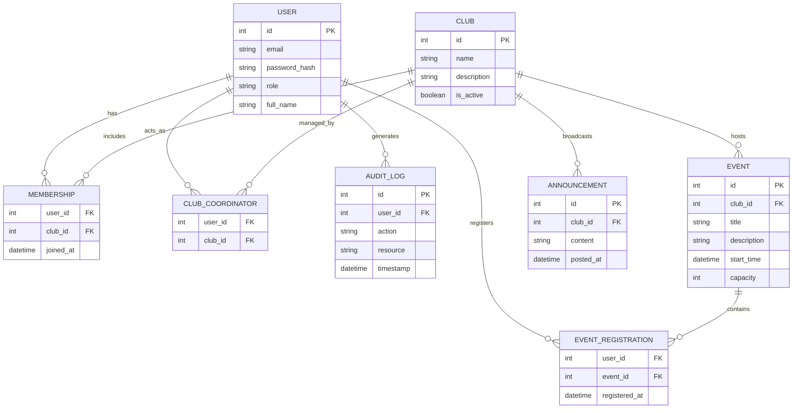
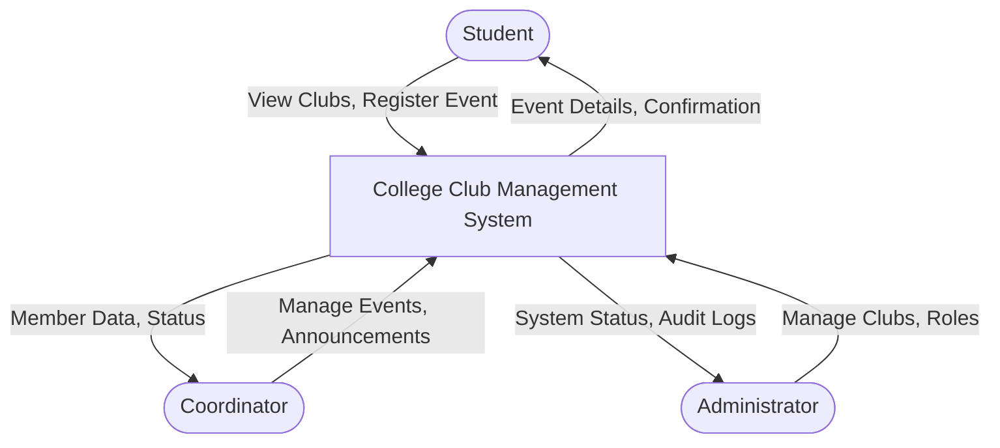
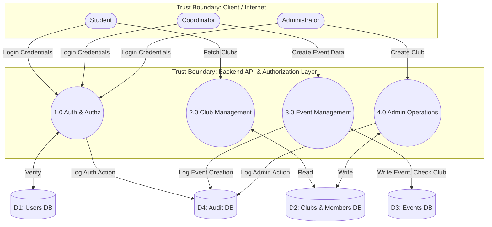

# Phase 4: ER Model and DFD

## Entity-Relationship (ER) Diagram

## Level-0 DFD (Context Diagram)

## Level-1 DFD

### Trust Boundaries
1. **Internet/User → Frontend:** Untrusted zone. Client-side input cannot be trusted.
2. **Frontend → Backend API:** The primary trust boundary where authentication and payload validation occurs.
3. **Privileged API → Authorization Layer:** Operations requiring elevated privileges (Coordinator, Admin) must pass through strict server-side RBAC before touching the database.
4. **Backend API → Database:** Trusted zone, but requires defense-in-depth (least privilege DB accounts).
