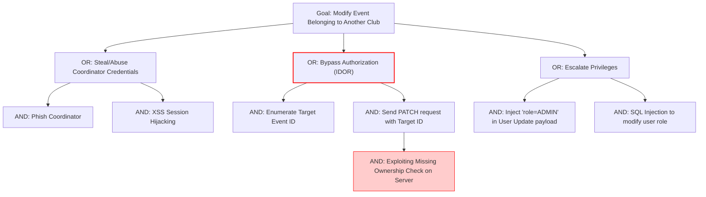

# Phase 8: Attack Tree

## Root Goal: Modify Event Belonging to Another Club

## Attack Paths and Controls

### 1. Bypass Authorization (IDOR) - Highest Risk
- **Path:** Attacker authenticates as a legitimate Coordinator. Attacker views the public Event list, notes the `event_id` of another club. Attacker sends an API request directly to modify that `event_id`.
- **Vulnerability:** Server checks if the user is a Coordinator but fails to check if the Coordinator is assigned to the Club that owns the Event.
- **Preventive Control:** Centralized Ownership Authorization Middleware (`verifyEventOwnership`).
- **Detective Control:** Audit log monitoring for unauthorized `403` attempts.

### 2. Privilege Escalation
- **Path:** Attacker exploits a weak Profile Update API endpoint to modify their role to `ADMIN`.
- **Preventive Control:** Strict DTO input validation; ignoring `role` fields in user-facing endpoints.

### 3. Session Hijacking
- **Path:** Attacker steals a JWT.
- **Preventive Control:** Use HttpOnly, Secure cookies for JWT transmission.
